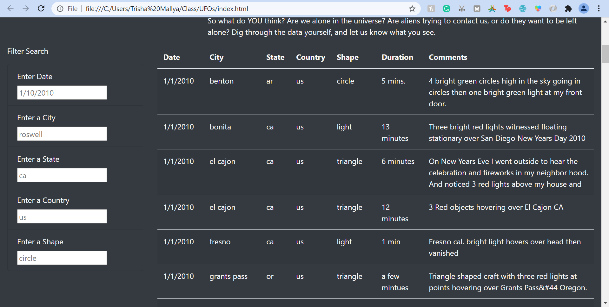
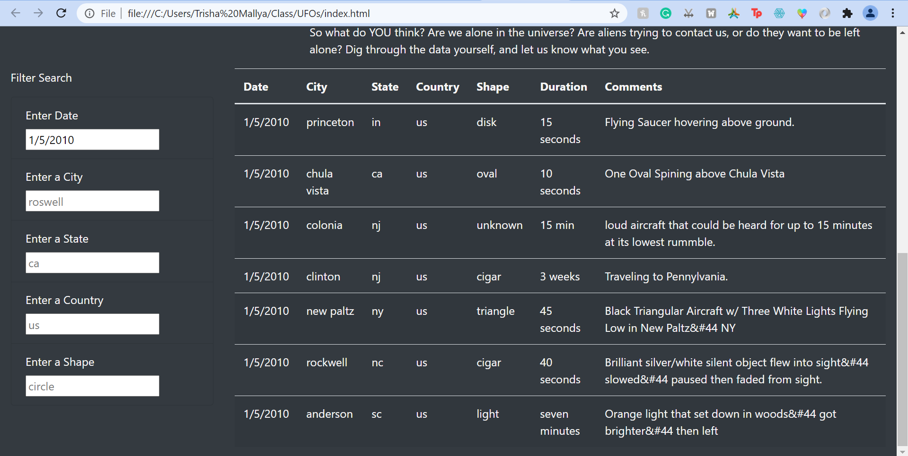
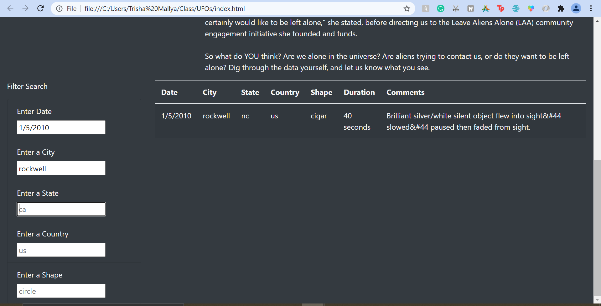

# UFOs

## Overview of Project
The purpose of this project is to use JavaScript, HTML, and CSS in order to create a webpage with the ability to filter data from UFO sightings around the world.

## Results
Filtering the data present at the bottom of the webpage is very easy. One can just input any value they wish to filter the table on using the spaces provided under each metric and the format provided in the example entry. After inputing a new filter, make sure to either press 'Enter' or click out of the text box in order for the filter to work. Here is a step by step example of searching for UFO sightings in Rockwell, NC on 1/5/2010:

- Initial table data

- First filter: date = 1/5/2010

- Second filter: city = rockwell

## Summary 
One drawback of this design is that the data is currently only ordered according to date (oldest at the top, most recent at the bottom). There may be scenarios in which individuals would like to filter on other properties, such as duration in order to easily determine the longest and shortest sightings. In order to further develop this design, I recommend implementing another filter that changes what property determines the order of the sighting data.

Another drawback is that the input for the filters are case sensitive. This means that if an individual were to input "Benton" instead of "benton" for the City, no data will appear in the output even though the city is present in the data. In order to account for this, I recommend including an additional conditional in the filtering function in order to allow different interpretations of the dates/words (for example, different capitalization or no "/" between numbers).
